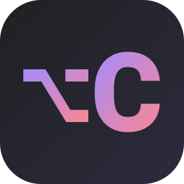

<p align="center">
  
</p>

<h1 align="center">Cai</h1>

<h3 align="center">Act on anything. Locally. </h3>

<p align="center">
  Select any text or image and transform with custom AI, scripts, shortcuts and more. Zero app switching. 
</p>

<p align="center">
  <a href="../../releases/latest"></a>
  
  
  <a href="https://huggingface.co/mlx-community"></a>
  

</p>

<p align="center">
  <a href="https://getcai.app">Website</a> · <a href="https://getcai.app/docs/">Docs</a> · <a href="../../releases/latest">Download</a> · <a href="https://github.com/cai-layer/cai-extensions">Extensions</a>
</p>

---

<p align="center">
  
</p>

## What

Select any text or image anywhere, press **⌥C**, and run AI prompts, shell scripts, or connectors like GitHub and Linear **without the app switching**. One hotkey, no config, everything runs locally.

No cloud. No telemetry. No accounts.

## How It Works

1. **Select text or copy an image** anywhere on your Mac
2. Press **⌥C** (Option+C)
3. Cai detects the content type and shows relevant actions
4. Pick an action with arrow keys or **⌘1–9**
5. Hit **return** to finish. Result is auto-copied to your clipboard — just **⌘V** to paste

**Examples:**

- Take a screenshot → Create GitHub issue
- Select a recipe → Ask AI: _"Extract ingredients for 2 people"_
- Select `"serendipity"` → Define, Explain, Translate, Search
- Select `"Let's meet Tuesday at 3pm at Starbucks"` → Create calendar event, Open in Maps
- Select an email in Mail → Reply, Summarize, Translate

→ [Read the full How It Works guide](https://getcai.app/docs/usage/how-it-works/)

## Features

- **Smart content detection** — recognizes what you copied (text, image, URL, JSON, meeting, address) and shows the right actions
- **Built-in AI** — [Apple Intelligence](https://getcai.app/docs/getting-started/llm-setup/) on macOS 26+, or in-process MLX inference on Apple Silicon. No server, no cloud, no setup
- **GitHub & Linear** — create issues from any selected text with AI-generated title, body, and duplicate detection
- **Custom actions** — save reusable AI prompts, URL templates, and shell commands as one-click actions
- **Image to Text** — on-device OCR via Apple Vision framework
- **Bring your own LLM** — works with [LM Studio](https://lmstudio.ai/), [Ollama](https://ollama.com/), any OpenAI-compatible server, or any model from [HuggingFace mlx-community](https://huggingface.co/mlx-community)

Also includes:

- **Custom output destinations** (Mail, Notes, webhooks, AppleScript)
- **Follow-up questions**
- **Context Snippets** (pass per-app context to the LLM)
- **Clipboard history** (last 100, search and pin)
- Keyboard-first (arrow keys, ⌘1–9)
- Community extensions

→ [See all features in the docs](https://getcai.app/docs/)

## Installation

### Homebrew

```bash
brew tap cai-layer/cai && brew install --cask cai
```

### Manual Download

1. Download the `.dmg` from the [latest release](../../releases/latest)
2. Open the DMG and drag **Cai.app** to your Applications folder

### After Install

1. Open the app and grant **Accessibility permission** when prompted
2. On macOS 26+, Cai uses Apple Intelligence automatically. Otherwise, the built-in MLX model downloads on first launch — or skip if you already use LM Studio / Ollama

→ [Full installation guide](https://getcai.app/docs/getting-started/installation/) · [LLM setup](https://getcai.app/docs/getting-started/llm-setup/)

### Build from Source

```bash
git clone https://github.com/cai-layer/cai.git
cd cai/Cai
open Cai.xcodeproj
```

In Xcode: select the **Cai** scheme and **My Mac** as destination, then **Product → Run** (⌘R).

> **Note:** The app requires **Accessibility permission** and runs **without App Sandbox** (required for global hotkey and CGEvent posting).

## What's New

→ Check the [full changelog](../../releases/latest)

## Documentation

Full documentation is at [getcai.app/docs](https://getcai.app/docs/):

- **[How It Works](https://getcai.app/docs/usage/how-it-works/)** — content detection, smart actions, follow-ups
- **[Keyboard Shortcuts](https://getcai.app/docs/usage/keyboard-shortcuts/)** — every key and what it does
- **[LLM Setup](https://getcai.app/docs/getting-started/llm-setup/)** — Apple Intelligence, MLX, LM Studio, Ollama, cloud providers
- **[Choosing a Model](https://getcai.app/docs/getting-started/llm-setup/#choosing-a-model)** — model picker guide and quantization explainer
- **[Ask AI](https://getcai.app/docs/usage/custom-actions/)** — free-form prompts on selected text
- **[Custom Actions](https://getcai.app/docs/usage/saved-actions/)** — save prompts, URLs, and shell commands
- **[Custom Destinations](https://getcai.app/docs/usage/destinations/)** — webhooks, AppleScript, deeplinks, shell
- **[Connectors](https://getcai.app/docs/usage/connectors/)** — GitHub and Linear integration
- **[Context Snippets](https://getcai.app/docs/usage/context-snippets/)** — per-app context for smarter actions
- **[Community Extensions](https://getcai.app/docs/usage/extensions/)** — install and create shared actions
- **[Troubleshooting](https://getcai.app/docs/troubleshooting/common-issues/)** — common issues and fixes

## Requirements

- **macOS 14.0** (Sonoma) or later
- **Apple Silicon** (M1 or later) for the built-in AI engine
- **8 GB RAM** minimum, 16 GB recommended for larger models
- **Accessibility permission** (for global hotkey ⌥C)

## Under the Hood

- **SwiftUI + AppKit** — native macOS, no Electron
- **[MLX-Swift](https://github.com/ml-explore/mlx-swift)** — in-process LLM inference on Apple Silicon, no subprocess or server
- **No App Sandbox** — global hotkey requires CGEvent posting outside the sandbox
- **[MCP](https://modelcontextprotocol.io/) via ~200-line JSON-RPC client** (Beta) — GitHub and Linear connectors with zero external MCP dependencies

---

## License

[MIT](LICENSE)
